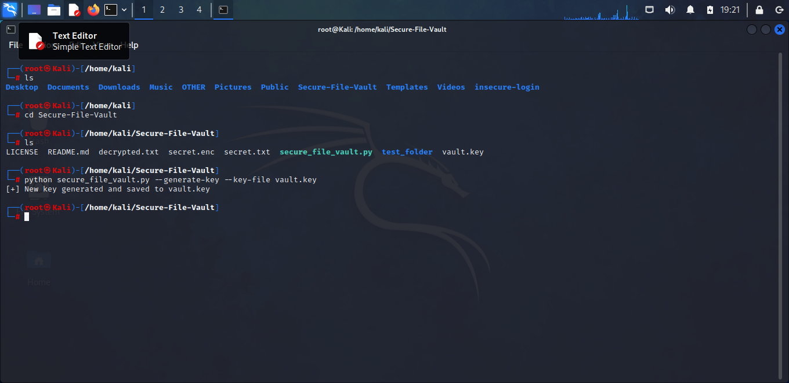
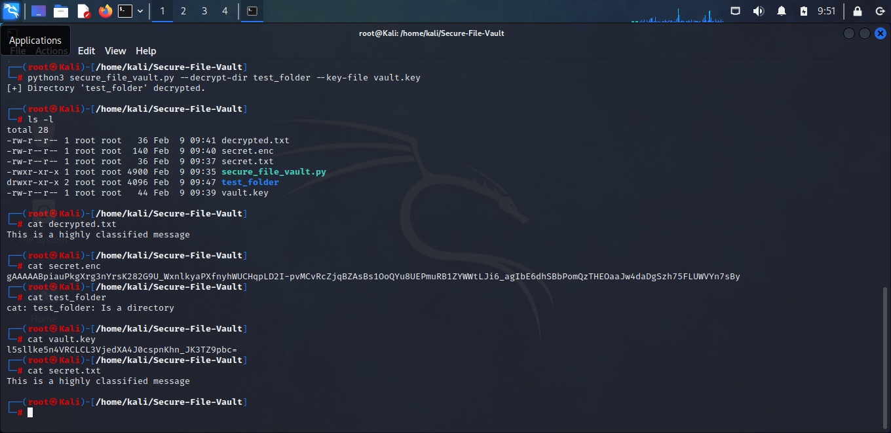
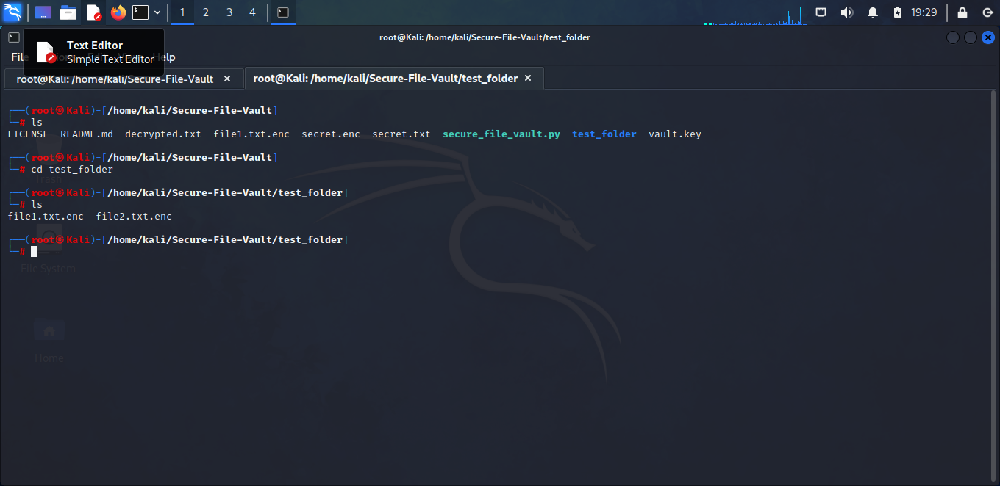

#  SecureFileVault  

### Advanced File Encryption Tool (Python + Cryptography)

SecureFileVault is a **professional file & directory encryption tool** built using the Python `cryptography` library (Fernet AES-128).  
It is designed to look and function as a project that demonstrates:

-  Strong Encryption  
-  Secure Key Management  
-  CLI-Based Cybersecurity Tooling  
-  Folder-Level Encryption  
-  Key Rotation  
-  Error Handling & Validation  
-  Clean, Clear, Well-Commented Code  

This tool is useful for **blue-team operations, secure data handling, forensics environments, and personal security**.

---

### **What Is Encryption?**

*Encryption transforms readable data (plaintext) into unreadable data (ciphertext) using a secret key.*
*Only someone with the correct key can decrypt it.*

**Fernet encryption (used in this project) provides**:

-**AES-128 encryption**: Encrypts files using a strong 128-bit key to keep data confidential.

-**HMAC for integrity verification**: Ensures the file has not been altered by generating a secure hash.

-**Protection against tampering**: Detects and blocks any unauthorized changes to encrypted files.

-**Timestamp-based tokens**: Adds time-limited token to prevent reuse of old or expired access requests.

This means **your data will stay confidential, verified, and safe**.

#  Features

###  File Encryption  
Encrypt any file using AES-128 (Fernet standard).

###  File Decryption  
Recover original files securely.

###  Directory Encryption  
Encrypt *every file* in a folder at once.

###  Directory Decryption  
Decrypt every `.enc` file recursively.

###  Key Generation  
Create strong Fernet keys & store them safely.

###  Key Rotation  
Change keys without breaking the encrypted files.

###  Detailed Logging & Error Handling  
For real use cases.


#  Installation

```
git clone https://github.com/YOUR_USERNAME/SecureFileVault.git
cd SecureFileVault
pip install cryptography
```
>**Kali Linux Note:**
>If `cryptography` is already installed, you're good to go.

## Creating the `Secure_file_vault.py` Script (Kali Linux)

Before using SecureFileVault, you must create the main Python script that contains all encryption and decryption logic.

**Steps**
1. *Create a directory named Secure_File_Vault* - `mkdir Secure-File_Vault`

2. *Open your project folder* - `cd Secure_File_Vault`

3. *Create a python script using nano* - `nano Secure_File_Vault.py`

4. *Paste the full encryption program code inside this file*

   -[Secure_File_Vault.py](secure_file_vault.py)

6. *Save and exit*

   -**nano**:

      Press `CTRL + O`, ENTER --> then CTRL + X 

7. *Confirm the fiel exists*: `ls`
---

#  Usage Guide
*Below are the main commands and what they do.*

---

###  Generate a new key

-**Make sure you are in the Secure-File-Vault directory
```
python Secure_File_Vault.py --generate-key --key-file vault.key
```



-*Creates a brand-new Fernet Key and stores it safely in `vault.key`.*

---

###  Encrypt a file
```
python Secure_File_Vault.py --encrypt secret.txt --output secret.enc --key-file vault.key
```
-*Reads the original file*

-*Encrypts it*

-*Saves encrypted output as `.enc`*

---

###  Decrypt a file
```bash
python Secure_File_Vault.py --decrypt secret.enc --output secret.txt --key-file vault.key
```
-*Restores the file to its original readable form*.




---

###  Encrypt a whole directory
```bash
python Secure_File_Vault.py --encrypt-dir myfolder --key-file vault.key
```
-*Encrypts every file inside `myfolder`*.

---

###  Decrypt a directory
```bash
python Secure_File_Vault.py --decrypt-dir myfolder --key-file vault.key
```
-*Decrypts all encrypted files.*




---

###  Rotate encryption key
```bash
python Secure_File_Vault.py --rotate-key --key-file vault.key
```
-*Generates a new key and updates the old one securely.*

---

#  Real-World Use Cases

-  Protecting sensitive logs  
-  Encrypting incident-response evidence  
-  Safeguarding credentials  
-  Backing up sensitive config files  
-  Secure local storage for small businesses  
-  Cybersecurity learning & demonstrations  

---

#  Security Notes

- Keep your key file (`vault.key`) private  
- Do NOT upload the key to GitHub  
- Rotate keys periodically  
- Delete original unencrypted files after encryption  
- For forensic-level deletion, use tools like:  
  - `shred`, `srm`, `wipe`

---

#  Author

**Cleveland Henry Lore**  
*Cybersecurity Enthusiast* | *Penetration Testing* 
